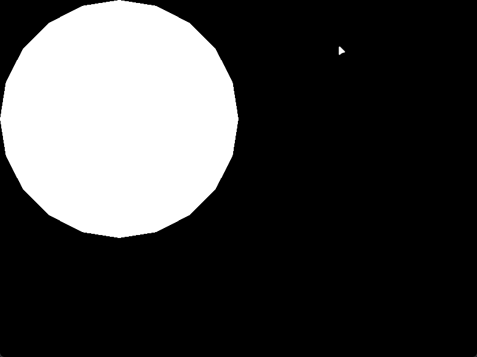
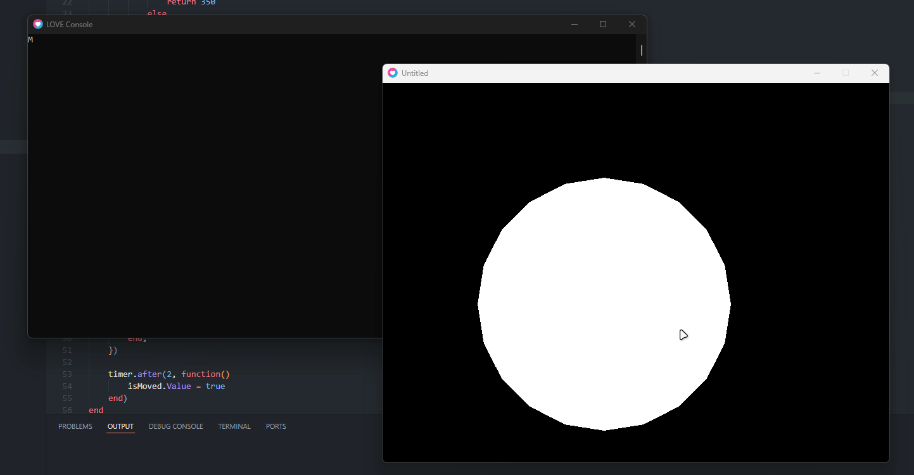

# Broid
Broid is an adaptation of Seam to Love2D, sharing much of the same API as it. Like Seam, you get the following in Broid:
* Reactive states
* Event sequences
* Animation
* Utilities
* And more!

## Example
```lua
function love.load()
    local scope = broid.scope(broid)
    local isMoved = scope:value(false)

    local object = scope:new("circle", {
        drawMode = enum.drawMode.fill,
        radius = 200,
        segments = 20,

        x = scope:spring(scope:computed(function(use)
            if use(isMoved) then
                return 350
            else
                return 200
            end
        end), 20, 0.5),

        y = scope:spring(scope:computed(function(use)
            if use(isMoved) then
                return 350
            else
                return 200
            end
        end), 15, 0.5),
       
        [event.mouseEnter] = function()
            print("Mouse entered!")
        end,

        [event.mouseLeave] = function()
            print("Mouse left!")
        end,

        [event.mouseButton1Down] = function()
            print("Mouse button 1 down!")
        end,

        [event.mouseButton1Up] = function()
            print("Mouse button 1 up!")
        end,
    })

    timer.after(2, function()
        isMoved.value = true
    end)
end
```





## Why use Broid?
I found other Love2D UI libraries to be cumbersome to use in comparison to what I'm used to on Roblox. What I didn't like especially is that elements weren't treated as objects, and instead just draw calls.

This is an extremely opinionated approach to solving this problem. Instead of a typical draw command wrapper, Broid uses Seam syntax to treat elements as, well, elements. Elements have properties that can be attached to states, in addition to having class-like properties and methods. Additionally, this allows you to treat elements as interactable objects, instead of just a render.

## This page is empty!
Correct. This is a WIP that I'm leaving public while I work on it. Expect more here soon!

## Progress so far
So far, the following is working from Seam:
* `new`
* `computed`
* `destroyed`
* `getValue`
* `isState`
* `lifetime`
* `scope`
* `spring`
* `tags`
* `value`

And these still need to be added:
* `component`
* `eventSequence`
* `onChanged`
* `onEvent`
* `onAttached`
* `setValue`
* `isComponent`
* `lockValue`
* `inspect`

However, the following will not be ported over since they are not needed in Love2D:
* `followProperty`
* `followAttribute`
* `attribute`
* `tween`
* `forPairs`
* `children`
* `onEvent`
* `onAttributeChanged`

I've also added these, which are specific to Broid:
* `enum`
* `event`
* `draw()`

As I work on this and learn more about Love2D, I might make more changes, add/remove features, etc.

## Supported elements
Refer to the below table to know what is supported, and to what degree

| Element type | Supports render | Supports input |
|--------------|-----------------|----------------|
| Arc | ✖ | ✖ |
| Circle | ✔ | ✔ |
| Drawable | ✖ | ✖ |
| Mesh | ✖ | ✖ |
| Array Texture | ✖ | ✖ |
| Quad | ✖ | ✖ |
| Ellipse | ✖ | ✖ |
| Line | ✖ | ✖ |
| Points | ✖ | ✖ |
| Polygon | ✖ | ✖ |
| Text | ✔ | ✔ |
| Rectangle | ✖ | ✖ |
| Stencil | ✖ | ✖ |
| Triangle | ✖ | ✖ |